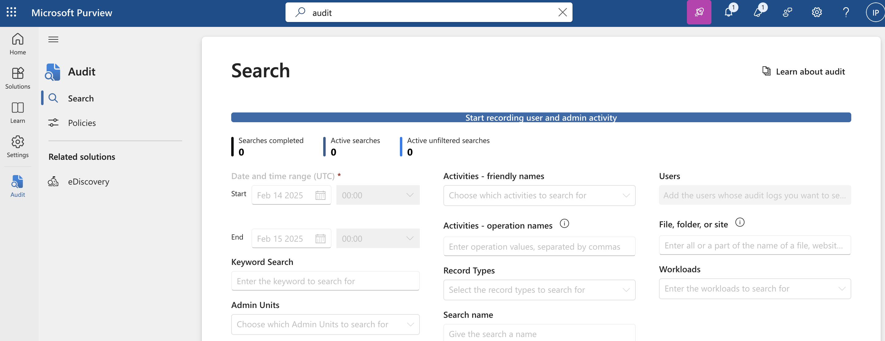
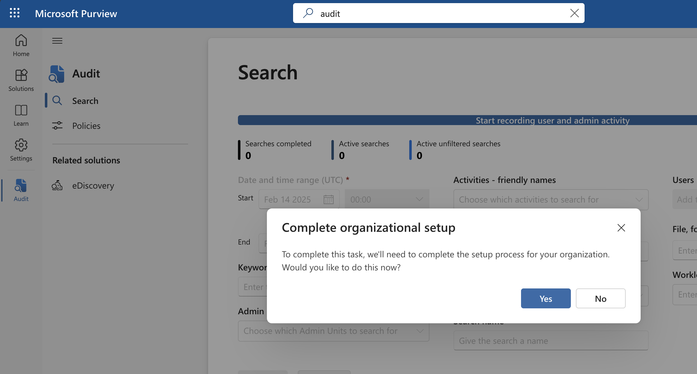

# Turn on Auditing in Microsoft Purview

1. Open Microsoft Purview Portal - https://purview.microsoft.com
2. When the portal is oppened, in the search bar enter "audit" to open Auditing solution
3. On the top of the auditing solution, you'll have a banner saying "Start recording user and admin activity". Click on it.

4. You'll get a pop-up asking you to complete "Organizational setup" - click Yes to confirm it

